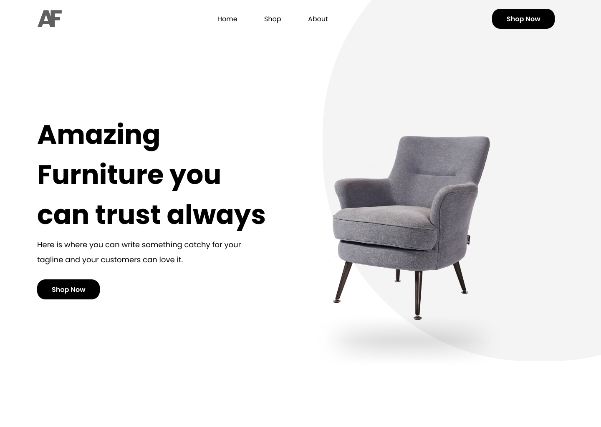

# Amazing-furniture Hero Web section

## Here is nice thing to try out your HTML-CSS-JS skills

### Screenshot

### Join the Challenge!
- clone the repo with `git clone`

- create a branch in the format `solution/[username]` so that its easy to identify

-  make a push to your branch on the upstream repo

This project gave me the opportunity to dive deeper into JavaScript, particularly when it came to handling logic, implementing solutions, and custom error handling. It was a challenge at first, but with practice, it's getting better every day. Now, I want to extend this learning experience to the community.

I'm hosting a challenge where you can practice and improve your skills in HTML, CSS, and JavaScript. You’ll get hands-on experience with:

Semantic HTML: Learn the best practices for structuring web content.
CSS Custom Properties & Responsive Design: Discover how to use relative units, Flexbox, and Grid to create adaptable, user-friendly designs.
JavaScript Logic & Error Handling: Work on real-world scenarios that challenge your problem-solving and implementation skills.
Submit a pull request to participate, share your solutions, and get feedback! It’s a great way to learn, improve, and collaborate with others.

this way you can get to learn a lot of the fundamentals and also level up you skills. However if you feel you have a better approach, using React.JS, tailwindCSS or SCSS with any other Javascript library, then feel free to complete the challenge.

